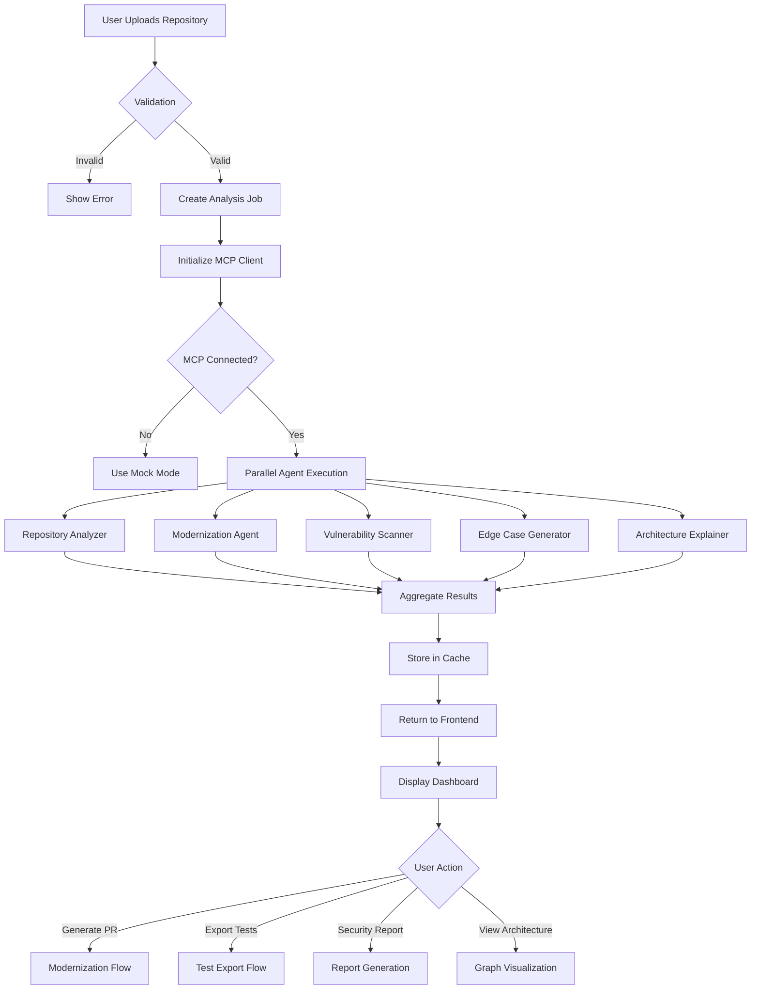

# 🔄 Technical Workflows

## Table of Contents

- [Complete Analysis Workflow](#complete-analysis-workflow)
- [Modernization Workflow](#modernization-workflow)
- [Security Scanning Workflow](#security-scanning-workflow)
- [Test Generation Workflow](#test-generation-workflow)
- [Architecture Analysis Workflow](#architecture-analysis-workflow)
- [Data Flow Diagrams](#data-flow-diagrams)
- [State Management](#state-management)
- [Error Handling](#error-handling)

---

## Complete Analysis Workflow

### End-to-End Process



### Step-by-Step Breakdown

#### Step 1: Repository Upload
```typescript
// Frontend: User uploads repository
const handleUpload = async (file: File | string) => {
  // Validate input
  if (typeof file === 'string') {
    // GitHub URL
    if (!isValidGitHubUrl(file)) {
      throw new Error('Invalid GitHub URL');
    }
  } else {
    // File upload
    if (file.size > MAX_FILE_SIZE) {
      throw new Error('File too large');
    }
  }
  
  // Send to backend
  const response = await fetch('/api/analyze', {
    method: 'POST',
    body: JSON.stringify({ repoPath: file }),
  });
  
  return response.json();
};
```

#### Step 2: Backend Processing
```typescript
// Backend: Analysis controller
export const analyzeRepository = async (req, res) => {
  try {
    // 1. Validate request
    const { repoPath, options } = validateAnalysisRequest(req.body);
    
    // 2. Generate unique ID
    const repoId = generateUUID();
    
    // 3. Check cache
    const cached = cache.get(repoId);
    if (cached) return res.json(cached);
    
    // 4. Initialize MCP client
    await mcpClient.connect();
    
    // 5. Execute analysis
    const results = await analysisService.analyze(repoPath, options);
    
    // 6. Store in cache
    cache.set(repoId, results, CACHE_TTL);
    
    // 7. Return results
    res.json({ repoId, ...results });
  } catch (error) {
    handleError(error, res);
  }
};
```

#### Step 3: Parallel Agent Execution
```typescript
// Service: Analysis service
export const analyze = async (repoPath: string, options: Options) => {
  // Execute all agents in parallel
  const [
    repoAnalysis,
    modernization,
    security,
    tests,
    architecture
  ] = await Promise.all([
    repoAnalyzer.analyze(repoPath),
    options.includeModernization ? modernizationAgent.analyze(repoPath) : null,
    options.includeSecurity ? vulnerabilityScanner.scan(repoPath) : null,
    options.includeTests ? edgeCaseGenerator.generate(repoPath) : null,
    options.includeArchitecture ? architectureExplainer.analyze(repoPath) : null,
  ]);
  
  // Aggregate results
  return {
    summary: repoAnalysis.summary,
    techStack: repoAnalysis.techStack,
    fileRisks: repoAnalysis.fileRisks,
    modernization,
    security,
    tests,
    architecture,
  };
};
```

#### Step 4: Frontend Display
```typescript
// Frontend: Display results
const AnalysisResults = ({ repoId }: Props) => {
  const { data, isLoading, error } = useQuery({
    queryKey: ['analysis', repoId],
    queryFn: () => fetchAnalysis(repoId),
  });
  
  if (isLoading) return <LoadingSpinner />;
  if (error) return <ErrorMessage error={error} />;
  
  return (
    <Dashboard>
      <RiskHeatmap data={data.fileRisks} />
      <TechStack stack={data.techStack} />
      <QuickActions repoId={repoId} />
      <MetricsSummary summary={data.summary} />
    </Dashboard>
  );
};
```

---

## Modernization Workflow

### Process Flow

```
1. Scan Codebase
   ↓
2. Detect Legacy Patterns
   ↓
3. Generate Modern Alternatives
   ↓
4. Create AI Rationale
   ↓
5. Display Comparisons
   ↓
6. User Reviews
   ↓
7. Generate PR Description
   ↓
8. User Applies Changes
```

### Implementation

#### Pattern Detection
```typescript
// MCP Agent: Modernization
class ModernizationAgent {
  async analyze(repoPath: string) {
    // 1. Read all source files
    const files = await readSourceFiles(repoPath);
    
    // 2. Detect patterns in parallel
    const patterns = await Promise.all(
      files.map(file => this.detectPatterns(file))
    );
    
    // 3. Generate suggestions
    const suggestions = await this.generateSuggestions(patterns);
    
    return {
      patternsFound: patterns.length,
      suggestions,
    };
  }
  
  private async detectPatterns(file: SourceFile) {
    const patterns = [];
    
    // Callback hell detection
    if (this.hasCallbackHell(file.content)) {
      patterns.push({
        type: 'callback-hell',
        file: file.path,
        lines: this.getAffectedLines(file),
      });
    }
    
    // var declarations
    if (this.hasVarDeclarations(file.content)) {
      patterns.push({
        type: 'var-declarations',
        file: file.path,
        lines: this.getVarLines(file),
      });
    }
    
    // Add more pattern detections...
    
    return patterns;
  }
  
  private async generateSuggestions(patterns: Pattern[]) {
    return Promise.all(
      patterns.map(async pattern => {
        // Send to MCP for AI analysis
        const response = await mcpClient.sendRequest({
          prompt: `Modernize this ${pattern.type} pattern`,
          context: { pattern },
        });
        
        return {
          pattern,
          before: pattern.code,
          after: response.data.modernCode,
          rationale: response.data.explanation,
        };
      })
    );
  }
}
```

#### PR Generation
```typescript
// Generate pull request description
const generatePR = async (repoId: string, patterns: string[]) => {
  // 1. Get analysis results
  const analysis = cache.get(repoId);
  
  // 2. Filter selected patterns
  const selectedSuggestions = analysis.modernization.suggestions
    .filter(s => patterns.includes(s.pattern.type));
  
  // 3. Generate PR description
  const prDescription = `
# Modernize Codebase

## Summary
This PR modernizes ${selectedSuggestions.length} legacy patterns in the codebase.

## Changes

${selectedSuggestions.map(s => `
### ${s.pattern.type}

**File:** \`${s.pattern.file}\`

**Before:**
\`\`\`javascript
${s.before}
\`\`\`

**After:**
\`\`\`javascript
${s.after}
\`\`\`

**Rationale:** ${s.rationale}
`).join('\n')}

## Testing
- [ ] All existing tests pass
- [ ] New tests added for modernized code
- [ ] Manual testing completed

## Checklist
- [ ] Code follows style guidelines
- [ ] Self-review completed
- [ ] Documentation updated
`;
  
  return {
    title: `Modernize: ${patterns.join(', ')}`,
    description: prDescription,
    filesChanged: selectedSuggestions.length,
  };
};
```

---

## Security Scanning Workflow

### Process Flow

```
1. Parse Source Files
   ↓
2. Run Security Rules
   ↓
3. Detect Vulnerabilities
   ↓
4. Map to CWE
   ↓
5. Assign Severity
   ↓
6. Generate Remediation
   ↓
7. Create Report
```

### Implementation

#### Vulnerability Detection
```typescript
class VulnerabilityScanner {
  async scan(repoPath: string) {
    // 1. Read source files
    const files = await readSourceFiles(repoPath);
    
    // 2. Run security rules
    const vulnerabilities = [];
    
    for (const file of files) {
      // SQL Injection
      vulnerabilities.push(...this.detectSQLInjection(file));
      
      // XSS
      vulnerabilities.push(...this.detectXSS(file));
      
      // CSRF
      vulnerabilities.push(...this.detectCSRF(file));
      
      // Hardcoded credentials
      vulnerabilities.push(...this.detectHardcodedCredentials(file));
      
      // Add more checks...
    }
    
    // 3. Map to CWE and assign severity
    const classified = await this.classifyVulnerabilities(vulnerabilities);
    
    // 4. Generate remediation steps
    const withRemediation = await this.addRemediation(classified);
    
    return {
      totalVulnerabilities: withRemediation.length,
      critical: withRemediation.filter(v => v.severity === 'critical').length,
      high: withRemediation.filter(v => v.severity === 'high').length,
      medium: withRemediation.filter(v => v.severity === 'medium').length,
      low: withRemediation.filter(v => v.severity === 'low').length,
      vulnerabilities: withRemediation,
    };
  }
  
  private detectSQLInjection(file: SourceFile) {
    const vulnerabilities = [];
    const sqlPattern = /query\s*=\s*[`"'].*\$\{.*\}.*[`"']/g;
    
    let match;
    while ((match = sqlPattern.exec(file.content)) !== null) {
      vulnerabilities.push({
        type: 'sql-injection',
        file: file.path,
        line: this.getLineNumber(file.content, match.index),
        code: match[0],
      });
    }
    
    return vulnerabilities;
  }
  
  private async classifyVulnerabilities(vulnerabilities: Vulnerability[]) {
    return vulnerabilities.map(vuln => ({
      ...vuln,
      cwe: this.getCWEMapping(vuln.type),
      severity: this.getSeverity(vuln.type),
    }));
  }
  
  private getCWEMapping(type: string): string {
    const mapping = {
      'sql-injection': 'CWE-89',
      'xss': 'CWE-79',
      'csrf': 'CWE-352',
      'hardcoded-credentials': 'CWE-798',
      // Add more mappings...
    };
    return mapping[type] || 'CWE-Unknown';
  }
}
```

#### Report Generation
```typescript
const generateSecurityReport = async (repoId: string, format: 'json' | 'pdf') => {
  // 1. Get analysis results
  const analysis = cache.get(repoId);
  const security = analysis.security;
  
  if (format === 'json') {
    return {
      repoId,
      generatedAt: new Date().toISOString(),
      summary: {
        totalVulnerabilities: security.totalVulnerabilities,
        critical: security.critical,
        high: security.high,
        medium: security.medium,
        low: security.low,
      },
      vulnerabilities: security.vulnerabilities,
    };
  }
  
  if (format === 'pdf') {
    // Generate PDF report
    const pdf = await generatePDF({
      title: 'Security Analysis Report',
      content: security,
    });
    return pdf;
  }
};
```

---

## Test Generation Workflow

### Process Flow

```
1. Analyze Functions/Endpoints
   ↓
2. Identify Input Parameters
   ↓
3. Generate Edge Cases
   ↓
4. Create Test Scenarios
   ↓
5. Format for Framework
   ↓
6. Bundle Tests
   ↓
7. Export ZIP
```

### Implementation

#### Test Generation
```typescript
class EdgeCaseGenerator {
  async generate(repoPath: string, framework: TestFramework) {
    // 1. Parse source files
    const files = await readSourceFiles(repoPath);
    
    // 2. Extract functions
    const functions = await this.extractFunctions(files);
    
    // 3. Generate test cases
    const tests = await Promise.all(
      functions.map(fn => this.generateTestsForFunction(fn, framework))
    );
    
    // 4. Format tests
    const formatted = this.formatTests(tests, framework);
    
    return {
      framework,
      testsGenerated: tests.length,
      files: formatted,
    };
  }
  
  private async generateTestsForFunction(fn: Function, framework: TestFramework) {
    const testCases = [];
    
    // Null/undefined inputs
    testCases.push(...this.generateNullTests(fn));
    
    // Boundary conditions
    testCases.push(...this.generateBoundaryTests(fn));
    
    // Type mismatches
    testCases.push(...this.generateTypeMismatchTests(fn));
    
    // Security attacks
    testCases.push(...this.generateSecurityTests(fn));
    
    // Race conditions
    if (fn.isAsync) {
      testCases.push(...this.generateRaceConditionTests(fn));
    }
    
    return {
      function: fn.name,
      file: fn.file,
      tests: testCases,
    };
  }
  
  private generateNullTests(fn: Function) {
    return fn.parameters.map(param => ({
      name: `should handle null ${param.name}`,
      type: 'null-input',
      code: this.generateTestCode(fn, { [param.name]: null }),
    }));
  }
  
  private formatTests(tests: Test[], framework: TestFramework) {
    switch (framework) {
      case 'jest':
        return this.formatJestTests(tests);
      case 'pytest':
        return this.formatPytestTests(tests);
      case 'postman':
        return this.formatPostmanTests(tests);
    }
  }
  
  private formatJestTests(tests: Test[]) {
    return tests.map(test => ({
      path: `tests/${test.file}.test.ts`,
      content: `
describe('${test.function}', () => {
  ${test.tests.map(t => `
  it('${t.name}', async () => {
    ${t.code}
  });
  `).join('\n')}
});
      `,
    }));
  }
}
```

#### Test Export
```typescript
const exportTests = async (repoId: string, framework: TestFramework) => {
  // 1. Get generated tests
  const analysis = cache.get(repoId);
  const tests = analysis.tests;
  
  // 2. Create ZIP bundle
  const zip = new AdmZip();
  
  // Add test files
  tests.files.forEach(file => {
    zip.addFile(file.path, Buffer.from(file.content));
  });
  
  // Add README
  zip.addFile('README.md', Buffer.from(`
# Generated Tests

Framework: ${framework}
Generated: ${new Date().toISOString()}

## Installation

\`\`\`bash
npm install
\`\`\`

## Running Tests

\`\`\`bash
npm test
\`\`\`
  `));
  
  // 3. Save to temp directory
  const bundleId = generateUUID();
  const zipPath = `${TEMP_DIR}/${bundleId}.zip`;
  zip.writeZip(zipPath);
  
  return {
    bundleId,
    downloadUrl: `/api/download/tests/${bundleId}.zip`,
    expiresAt: new Date(Date.now() + 3600000).toISOString(),
  };
};
```

---

## Architecture Analysis Workflow

### Process Flow

```
1. Parse Import Statements
   ↓
2. Build Dependency Graph
   ↓
3. Analyze Relationships
   ↓
4. Detect Bottlenecks
   ↓
5. Find Circular Dependencies
   ↓
6. Generate Visualization Data
   ↓
7. Render Interactive Graph
```

### Implementation

#### Dependency Graph Building
```typescript
class ArchitectureExplainer {
  async analyze(repoPath: string) {
    // 1. Parse all files
    const files = await readSourceFiles(repoPath);
    
    // 2. Extract imports
    const imports = await this.extractImports(files);
    
    // 3. Build graph
    const graph = this.buildDependencyGraph(imports);
    
    // 4. Analyze graph
    const analysis = this.analyzeGraph(graph);
    
    return {
      nodes: graph.nodes,
      edges: graph.edges,
      bottlenecks: analysis.bottlenecks,
      circularDependencies: analysis.circularDependencies,
      suggestions: analysis.suggestions,
    };
  }
  
  private buildDependencyGraph(imports: Import[]) {
    const nodes = new Map();
    const edges = [];
    
    imports.forEach(imp => {
      // Add source node
      if (!nodes.has(imp.source)) {
        nodes.set(imp.source, {
          id: imp.source,
          name: path.basename(imp.source),
          type: this.getNodeType(imp.source),
          dependencies: [],
        });
      }
      
      // Add target node
      if (!nodes.has(imp.target)) {
        nodes.set(imp.target, {
          id: imp.target,
          name: path.basename(imp.target),
          type: this.getNodeType(imp.target),
          dependencies: [],
        });
      }
      
      // Add edge
      edges.push({
        source: imp.source,
        target: imp.target,
        type: 'imports',
      });
      
      // Update dependencies
      nodes.get(imp.source).dependencies.push(imp.target);
    });
    
    return {
      nodes: Array.from(nodes.values()),
      edges,
    };
  }
  
  private analyzeGraph(graph: Graph) {
    return {
      bottlenecks: this.findBottlenecks(graph),
      circularDependencies: this.findCircularDependencies(graph),
      suggestions: this.generateSuggestions(graph),
    };
  }
  
  private findBottlenecks(graph: Graph) {
    const bottlenecks = [];
    
    graph.nodes.forEach(node => {
      const inDegree = graph.edges.filter(e => e.target === node.id).length;
      const outDegree = graph.edges.filter(e => e.source === node.id).length;
      
      // High coupling
      if (inDegree + outDegree > 10) {
        bottlenecks.push({
          nodeId: node.id,
          reason: 'High coupling',
          severity: 'high',
          inDegree,
          outDegree,
        });
      }
    });
    
    return bottlenecks;
  }
  
  private findCircularDependencies(graph: Graph) {
    const visited = new Set();
    const recursionStack = new Set();
    const cycles = [];
    
    const dfs = (nodeId: string, path: string[]) => {
      visited.add(nodeId);
      recursionStack.add(nodeId);
      path.push(nodeId);
      
      const node = graph.nodes.find(n => n.id === nodeId);
      node.dependencies.forEach(depId => {
        if (!visited.has(depId)) {
          dfs(depId, [...path]);
        } else if (recursionStack.has(depId)) {
          // Found cycle
          const cycleStart = path.indexOf(depId);
          cycles.push(path.slice(cycleStart));
        }
      });
      
      recursionStack.delete(nodeId);
    };
    
    graph.nodes.forEach(node => {
      if (!visited.has(node.id)) {
        dfs(node.id, []);
      }
    });
    
    return cycles;
  }
}
```

---

## Data Flow Diagrams

### Frontend to Backend

```
User Action
    ↓
React Component
    ↓
TanStack Query (useQuery/useMutation)
    ↓
API Client (fetch/axios)
    ↓
HTTP Request
    ↓
Express Middleware Stack
    ↓
Route Handler
    ↓
Controller
    ↓
Service Layer
    ↓
MCP Client
    ↓
MCP Agents
    ↓
AI Analysis
    ↓
Response Aggregation
    ↓
Cache Storage
    ↓
JSON Response
    ↓
TanStack Query Cache
    ↓
React Component Update
    ↓
UI Render
```

### MCP Communication

```
Service Layer
    ↓
MCP Client.sendRequest()
    ↓
Create MCPRequest
    ↓
StdioClientTransport
    ↓
MCP Server (IBM Bob)
    ↓
AI Model Processing
    ↓
MCPResponse
    ↓
Parse Response
    ↓
Return to Service
```

---

## State Management

### Frontend State Flow

```typescript
// 1. Server State (TanStack Query)
const { data, isLoading } = useQuery({
  queryKey: ['analysis', repoId],
  queryFn: () => fetchAnalysis(repoId),
  staleTime: 5 * 60 * 1000,
});

// 2. UI State (React useState)
const [selectedPattern, setSelectedPattern] = useState(null);

// 3. Form State (React Hook Form)
const form = useForm({
  defaultValues: { repoPath: '' },
});

// 4. URL State (TanStack Router)
const navigate = useNavigate();
navigate({ to: '/dashboard', search: { repoId } });
```

### Backend State Flow

```typescript
// 1. Request State
const requestId = generateUUID();
logger.info('Request started', { requestId });

// 2. Cache State
cache.set(repoId, results, TTL);

// 3. MCP Connection State
await mcpClient.connect();
const isConnected = mcpClient.isClientConnected();

// 4. Response State
res.status(200).json({ success: true, data });
```

---

## Error Handling

### Frontend Error Handling

```typescript
// TanStack Query error handling
const { data, error } = useQuery({
  queryKey: ['analysis', repoId],
  queryFn: fetchAnalysis,
  retry: 3,
  retryDelay: (attemptIndex) => Math.min(1000 * 2 ** attemptIndex, 30000),
  onError: (error) => {
    toast.error(`Analysis failed: ${error.message}`);
  },
});

// Component error boundary
<ErrorBoundary fallback={<ErrorPage />}>
  <AnalysisResults />
</ErrorBoundary>
```

### Backend Error Handling

```typescript
// Global error handler
app.use((error, req, res, next) => {
  logger.error('Request failed', {
    error: error.message,
    stack: error.stack,
    path: req.path,
  });
  
  res.status(error.statusCode || 500).json({
    error: error.name,
    message: error.message,
    statusCode: error.statusCode || 500,
    timestamp: new Date().toISOString(),
    path: req.path,
  });
});

// MCP error handling
try {
  const response = await mcpClient.sendRequestWithRetry(request);
  return response;
} catch (error) {
  logger.error('MCP request failed', { error });
  return {
    success: false,
    error: 'Analysis failed. Please try again.',
  };
}
```

---

**Built with ❤️ for hackathons, made for engineers**

*CodeGuardian AI - Technical Workflows*